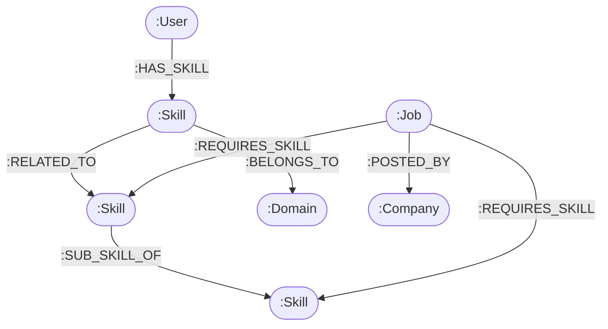

# NexusGraph: Knowledge Graph-Backed Career Intelligence & Skill Traversal Platform

> **Candidate Take-Home Assignment Submission for Wexa AI**  
> **Database Layer**: [CognoDB Cloud](https://console.cognodb.com) (openCypher over Bolt protocol via `neo4j-driver`)  
> **Stack**: React.js (Frontend), Node.js / Express (Backend), openCypher (Database)

---

## 1. Why a Graph Database?

Relational databases (SQL) represent data in normalized tables. However, career intelligence and skills are **inherently non-linear, interconnected networks**:

1. **Index-Free Adjacency vs Combinatorial SQL Joins**:
   - Matching a candidate to a job across direct skills, related sub-skills, domain categories, and company preferences in SQL requires joining 5+ tables (`users` → `user_skills` → `skills` → `skill_ontology` → `job_skills` → `jobs`).
   - In SQL, multi-table joins execute in \(O(N \times M)\) time complexity through index lookups.
   - In **CognoDB**, relationships are stored as direct physical memory pointers (index-free adjacency). Traversing graph edges runs in \(O(k)\) time proportional only to the candidate's degree, **regardless of how large the global database grows**.

2. **Multi-Hop Transitive Skill Ontologies (The Graph Proof)**:
   - Real-world skills have semantic parent/child and lateral relationships:
     $$\text{Docker} \xrightarrow{\text{:RELATED_TO}} \text{Kubernetes} \xrightarrow{\text{:RELATED_TO}} \text{AWS}$$
     $$\text{Next.js} \xrightarrow{\text{:SUB_SKILL_OF}} \text{React}$$
   - In openCypher, discovering candidate-to-job bridges across arbitrary variable-length hops is accomplished cleanly in a single declarative query:
     `MATCH path = (userSkill)-[:RELATED_TO|SUB_SKILL_OF*1..2]-(reqSkill)<-[:REQUIRES_SKILL]-(job)`
   - In SQL, this requires recursive Common Table Expressions (CTEs), which are slow, complex to maintain, and brittle to schema changes.

3. **High-Leverage Skill Gap Discovery**:
   - Identifying the *single missing skill* that unlocks the greatest number of new career opportunities requires global network aggregation. A graph query naturally groups missing requirement nodes across all jobs and ranks high-leverage skill gaps in milliseconds.

---

## 2. Graph Data Model & Architecture

### Entity Nodes
- `(:User {id, name, email, passwordHash, title, experienceYears, createdAt})`
- `(:Skill {name, category, description})`
- `(:Job {id, title, location, type, experienceLevel, salaryRange, description, createdAt})`
- `(:Domain {name, category})`
- `(:Company {name, industry, location})`

### Relationship Edges
- `(:User)-[:HAS_SKILL {proficiency, addedAt}]->(:Skill)`
- `(:Job)-[:REQUIRES_SKILL {importance}]->(:Skill)`
- `(:Job)-[:POSTED_BY]->(:Company)`
- `(:Skill)-[:RELATED_TO {weight}]->(:Skill)` *(bidirectional)*
- `(:Skill)-[:SUB_SKILL_OF {weight}]->(:Skill)` *(hierarchical)*
- `(:Skill)-[:BELONGS_TO]->(:Domain)`



---

## 3. Core Parameterized openCypher Queries

### Query 1: Direct 1-Hop Skill Overlap & Score Calculation
```cypher
MATCH (u:User {id: $userId})
MATCH (j:Job)-[:REQUIRES_SKILL]->(req:Skill)
WHERE ($search = '' OR toLower(j.title) CONTAINS toLower($search) OR toLower(j.description) CONTAINS toLower($search))
  AND ($experience = '' OR j.experienceLevel = $experience)
OPTIONAL MATCH (u)-[:HAS_SKILL]->(userSkill:Skill)
WHERE (j)-[:REQUIRES_SKILL]->(userSkill)
WITH j, 
     count(DISTINCT req) AS totalRequired, 
     collect(DISTINCT req.name) AS requiredSkillList,
     collect(DISTINCT userSkill.name) AS matchedSkills
WHERE size(matchedSkills) > 0
MATCH (j)-[:POSTED_BY]->(c:Company)
WITH j, c, totalRequired, requiredSkillList, matchedSkills,
     round((toFloat(size(matchedSkills)) / totalRequired) * 100) AS matchPercentage
RETURN j, c, requiredSkillList, matchedSkills, matchPercentage
ORDER BY matchPercentage DESC, j.createdAt DESC
```

### Query 2: Multi-Hop Transitive Related Matches (2+ Hops)
*Discovers jobs matching via ontological graph bridges and yields path proofs:*
```cypher
MATCH (u:User {id: $userId})-[:HAS_SKILL]->(s:Skill)
WITH u, collect(s.name) AS userSkillNames, collect(s) AS userSkills
UNWIND userSkills AS userSkill
MATCH path = (userSkill)-[:RELATED_TO|SUB_SKILL_OF*1..2]-(reqSkill:Skill)
WHERE NOT reqSkill.name IN userSkillNames
MATCH (j:Job)-[:REQUIRES_SKILL]->(reqSkill)
MATCH (j)-[:POSTED_BY]->(c:Company)
MATCH (j)-[:REQUIRES_SKILL]->(allReq:Skill)
WITH j, c, userSkill, reqSkill, path,
     relationships(path) AS rels,
     [n IN nodes(path) | n.name] AS pathNodes,
     collect(DISTINCT allReq.name) AS allRequiredSkills
WITH j, c, allRequiredSkills,
     collect(DISTINCT {
       yourSkill: userSkill.name,
       requiredSkill: reqSkill.name,
       hops: length(path),
       pathSummary: pathNodes,
       relationship: type(rels[0])
     }) AS graphBridges
ORDER BY size(graphBridges) DESC, j.createdAt DESC
```

### Query 3: High-Leverage Skill Gap Discovery (Awkward for SQL)
*Calculates which single skill node unlocks the maximum number of new job matches:*
```cypher
MATCH (u:User {id: $userId})
MATCH (targetJob:Job)-[:REQUIRES_SKILL]->(missingSkill:Skill)
WHERE NOT (u)-[:HAS_SKILL]->(missingSkill)
WITH missingSkill, count(DISTINCT targetJob) AS unlockedJobCount, 
     collect(DISTINCT targetJob.title)[0..3] AS sampleJobTitles
MATCH (missingSkill)-[:BELONGS_TO]->(d:Domain)
RETURN missingSkill.name, missingSkill.category, d.name, 
       unlockedJobCount, sampleJobTitles
ORDER BY unlockedJobCount DESC
LIMIT 6
```

---

## 4. Getting Started & Setup Instructions

### Prerequisites
- Node.js (v18+)
- A [CognoDB Cloud](https://console.cognodb.com) instance

### 1. Configure Environment Variables
Inside `backend/.env`:
```env
PORT=5000
COGNODB_URI=bolt+s://<instance-id>.databases.cognodb.cloud
COGNODB_USER=cognodb
COGNODB_PASSWORD=<your-instance-password>
JWT_SECRET=your_super_secure_jwt_secret_key
NODE_ENV=development
```

### 2. Seed CognoDB Graph Database
Run the seed script to automatically populate domains, ontology relationships, realistic jobs, and candidate profiles:
```bash
cd backend
npm install
npm run seed
```

### 3. Run the Backend API
```bash
cd backend
npm start
# Server runs on http://localhost:5000
# Health Check: http://localhost:5000/api/graph/health
```

### 4. Run the Frontend Web Application
```bash
cd frontend
npm install
npm run dev
# Frontend runs on http://localhost:3000
```

---

## 5. Instant Evaluator Test Profiles (1-Click Switcher)

The application includes a **Demo Switcher** in the top navbar:
1. **Alex Rivera** (`alex.frontend@wexa.ai`) — *Senior Frontend Architect* (React, TypeScript, Next.js, Tailwind CSS)
2. **Jordan Chen** (`jordan.devops@wexa.ai`) — *Cloud & SRE Engineer* (Docker, AWS, CI/CD, Terraform)
3. **Dr. Elena Rostova** (`elena.ai@wexa.ai`) — *AI & Knowledge Graph Researcher* (Python, PyTorch, CognoDB, Machine Learning)
4. **Sam Taylor** (`sam.junior@wexa.ai`) — *Junior Full Stack Enthusiast* (JavaScript, HTML/CSS, React, Node.js)

*Default password for demo profiles*: `Password123!`

---

## 6. Project Structure
```
graph-job-matcher/
├── backend/
│   ├── src/
│   │   ├── config/          # CognoDB neo4j-driver connection pool & helpers
│   │   ├── controllers/     # Auth, Jobs, Skills, Graph controllers
│   │   ├── middleware/      # JWT Authentication guards
│   │   ├── routes/          # Express REST API routes
│   │   ├── services/        # Parameterized Cypher query engine
│   │   ├── scripts/         # CognoDB seed & connection test scripts
│   │   ├── app.js           # Express application configuration
│   │   └── server.js        # Server entry point & DB health check
│   ├── .env.example
│   ├── .env
│   └── package.json
├── frontend/
│   ├── src/
│   │   ├── components/      # Navbar, JobCard, InteractiveGraphCanvas, Footer
│   │   ├── context/         # AuthContext with 1-click persona switching
│   │   ├── pages/           # HomePage, JobListPage, SkillGraphPage, AboutUsPage, etc.
│   │   ├── services/        # Axios API client
│   │   ├── App.jsx          # Route mapping
│   │   ├── index.css        # Tailwind directives & glow effects
│   │   └── main.jsx
│   ├── vite.config.js       # Vite configuration with API proxy
│   ├── tailwind.config.js
│   └── package.json
└── README.md
```
